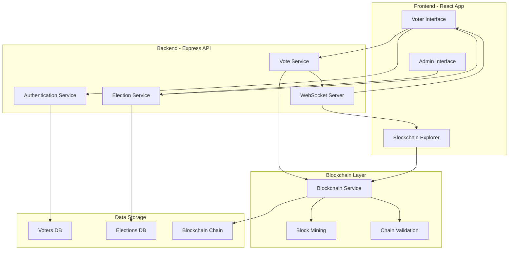
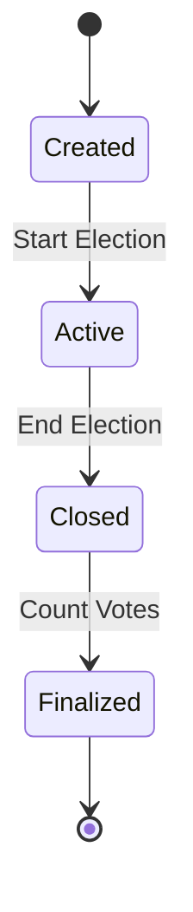
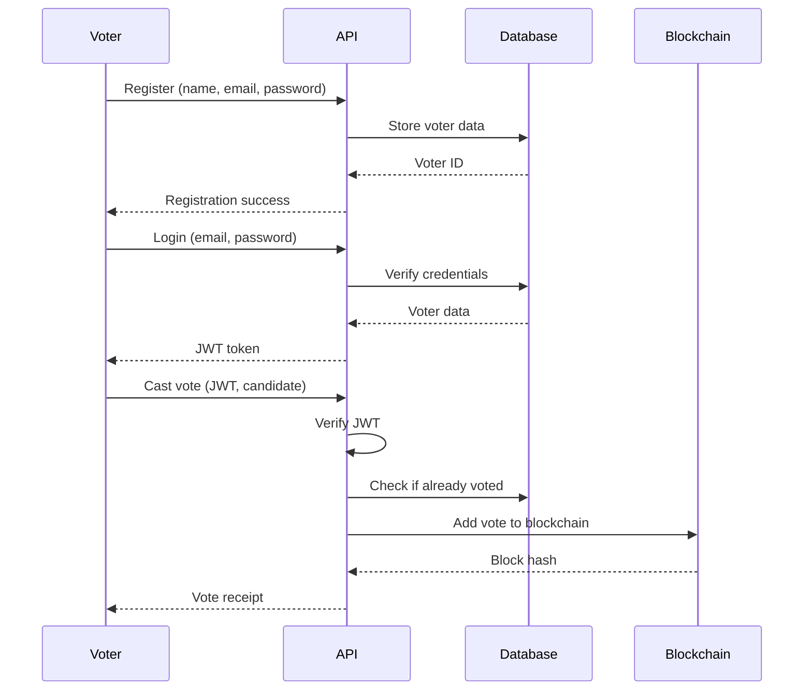

# Blockchain-Based Election Voting System - Architecture

## Overview

This is a secure, transparent election voting system built with a custom blockchain implementation. The system ensures vote integrity, voter authentication, and result transparency while maintaining voter anonymity.

## Technology Stack

- **Frontend**: React + Vite + TypeScript
- **Backend**: Express.js + Node.js
- **Blockchain**: Custom implementation with proof-of-work
- **Authentication**: JWT + bcrypt
- **Real-time**: WebSocket (Socket.io)
- **Monorepo**: Turborepo + pnpm
- **Database**: In-memory (can be extended to PostgreSQL/MongoDB)

## System Architecture



## Project Structure

```
voting-chain/
├── apps/
│   ├── api/                    # Express API server
│   │   ├── src/
│   │   │   ├── routes/         # API routes
│   │   │   ├── controllers/    # Request handlers
│   │   │   ├── middleware/     # Auth, validation
│   │   │   ├── services/       # Business logic
│   │   │   └── server.ts       # Entry point
│   │   └── package.json
│   │
│   └── web/                    # React frontend (Vite)
│       ├── src/
│       │   ├── components/     # React components
│       │   ├── pages/          # Page components
│       │   ├── hooks/          # Custom hooks
│       │   ├── services/       # API clients
│       │   └── main.tsx        # Entry point
│       └── package.json
│
├── packages/
│   ├── blockchain/             # Blockchain implementation
│   │   ├── src/
│   │   │   ├── Block.ts        # Block class
│   │   │   ├── Blockchain.ts   # Blockchain class
│   │   │   └── index.ts
│   │   └── package.json
│   │
│   ├── types/                  # Shared TypeScript types
│   │   ├── src/
│   │   │   ├── election.ts
│   │   │   ├── voter.ts
│   │   │   ├── vote.ts
│   │   │   └── index.ts
│   │   └── package.json
│   │
│   └── ui/                     # Shared UI components
│       ├── src/
│       │   ├── Button.tsx
│       │   ├── Card.tsx
│       │   └── index.ts
│       └── package.json
│
└── package.json
```

## Core Components

### 1. Blockchain Implementation

#### Block Structure
```typescript
class Block {
  index: number;
  timestamp: number;
  data: VoteData;
  previousHash: string;
  hash: string;
  nonce: number;
}
```

#### Blockchain Features
- **Proof-of-Work**: Mining with adjustable difficulty
- **Chain Validation**: Verify integrity of entire chain
- **Immutability**: Once added, blocks cannot be modified
- **Transparency**: All votes are publicly verifiable

### 2. Election System

#### Election Lifecycle


#### Key Features
- Create elections with multiple candidates
- Set start and end times
- Manage candidate registration
- Real-time vote counting

### 3. Voter Authentication

#### Authentication Flow


### 4. Vote Casting Process

#### Vote Data Structure
```typescript
interface VoteData {
  electionId: string;
  candidateId: string;
  voterHash: string;  // Hashed voter ID for anonymity
  timestamp: number;
}
```

#### Security Measures
- **One Vote Per Voter**: Track votes in database
- **Anonymity**: Store hashed voter ID in blockchain
- **Verifiability**: Voters receive receipt with block hash
- **Immutability**: Votes cannot be changed once recorded

### 5. Results Dashboard

#### Features
- Real-time vote counting
- Candidate rankings
- Vote distribution charts
- Blockchain verification status

## API Endpoints

### Authentication
- `POST /api/auth/register` - Register new voter
- `POST /api/auth/login` - Login and get JWT token

### Elections
- `GET /api/elections` - List all elections
- `GET /api/elections/:id` - Get election details
- `POST /api/elections` - Create new election (admin)
- `PUT /api/elections/:id` - Update election (admin)

### Candidates
- `GET /api/elections/:id/candidates` - List candidates
- `POST /api/elections/:id/candidates` - Add candidate (admin)

### Voting
- `POST /api/vote` - Cast a vote
- `GET /api/vote/verify/:hash` - Verify vote by receipt hash
- `GET /api/elections/:id/results` - Get election results

### Blockchain
- `GET /api/blockchain` - Get entire blockchain
- `GET /api/blockchain/block/:index` - Get specific block
- `GET /api/blockchain/validate` - Validate blockchain integrity

## Security Considerations

### 1. Voter Authentication
- Passwords hashed with bcrypt (10 rounds)
- JWT tokens with expiration
- Secure session management

### 2. Vote Integrity
- Blockchain immutability
- Cryptographic hashing (SHA-256)
- Chain validation on every block addition

### 3. Vote Anonymity
- Voter ID hashed before storing in blockchain
- No direct link between voter and vote in blockchain
- Database tracks voting status separately

### 4. Double Voting Prevention
- Database flag for voted status
- Middleware checks before vote casting
- Transaction-like operations

## Real-time Features

### WebSocket Events
- `election:created` - New election created
- `election:started` - Election voting opened
- `election:ended` - Election closed
- `vote:cast` - New vote recorded
- `block:mined` - New block added to chain
- `results:updated` - Vote counts updated

## Deployment Considerations

### Development
```bash
pnpm install
pnpm dev
```

### Production
- Use environment variables for secrets
- Enable HTTPS
- Add rate limiting
- Implement proper logging
- Use persistent database (PostgreSQL/MongoDB)
- Deploy blockchain nodes separately
- Add backup and recovery mechanisms

## Future Enhancements

1. **Multi-node Blockchain**: Distributed consensus
2. **Smart Contracts**: Automated election rules
3. **Mobile App**: React Native application
4. **Biometric Auth**: Enhanced voter verification
5. **Audit Trail**: Comprehensive logging system
6. **Analytics**: Advanced voting pattern analysis
7. **Email Notifications**: Vote confirmations
8. **Admin Dashboard**: Election management UI

## Testing Strategy

### Unit Tests
- Blockchain operations
- Vote validation
- Authentication logic

### Integration Tests
- API endpoints
- Database operations
- WebSocket events

### End-to-End Tests
- Complete voting flow
- Election lifecycle
- Result verification

## Performance Considerations

- **Mining Difficulty**: Adjust based on load
- **Caching**: Cache election and candidate data
- **Database Indexing**: Index frequently queried fields
- **WebSocket Optimization**: Room-based broadcasting
- **API Rate Limiting**: Prevent abuse

## Compliance & Legal

- **Data Privacy**: GDPR compliance for voter data
- **Audit Logs**: Maintain comprehensive logs
- **Transparency**: Public blockchain verification
- **Accessibility**: WCAG 2.1 AA compliance